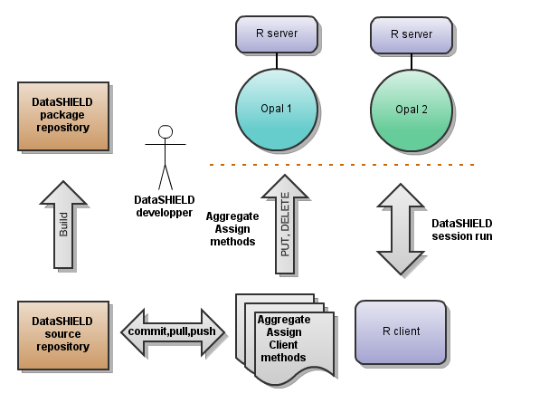



## Overview

* [Set up](#setup)
  * [Server side set up](#serversetup)
  * [Client side set up](#clientsetup)
* [Development Workflow](#flow)
* [DataSHIELD-R Packages](#packages)

## Set up

First you need to setup a development infrastructure for running DataSHIELD analysis. This infrastructure will be based on [Opal](http://wiki.obiba.org/display/OPALDOC).

### Server side set up

At least two Opal server instances, in which different harmonized datasets have been loaded are required to execute some DataSHIELD analysis.

See: [Opal Server Administrator Guide](http://wiki.obiba.org/display/OPALDOC/Opal+Server+Administrator+Guide)

Each Opal server instance must be backed by a R server in which data will be pushed from Opal for being aggregated.

See: [Opal R Server Set Up](http://wiki.obiba.org/display/OPALDOC/Opal+R+and+DataSHIELD+User+Guide#OpalRandDataSHIELDUserGuide-ServersideInstallation)

An harmonized dataset must be prepared and each Opal server instances will receive data for different set of participants.

See: [Opal Web Application User Guide](http://wiki.obiba.org/display/OPALDOCDEV/Opal+Web+Application+User+Guide)

### Client side set up

R must be installed on the client side.

See: [Download and Install R](http://cran.r-project.org/)

The source code of the R packages for DataSHIELD are hosted on [GitHub](https://github.com/datashield). Git is a VCS (Version Control System), a simple command line tool for keeping a history on the state of your source code projects. Git allows groups of people to work on the same documents (often code) at the same time, and without stepping on each other's toes.

See:
* [Set Up Git](https://help.github.com/articles/set-up-git)
* [Getting Started Installing Git](http://git-scm.com/book/en/Getting-Started-Installing-Git)
* [GitHub Help](https://help.github.com)
* [Try GitHub (tutorial)](http://try.github.com)

We also highly recommend to use an IDE (Integrated Development Environment) software such as [RStudio](http://www.rstudio.com/). RStudio provides a R editor (syntax checking, auto completion...), integrates with Git, allows R packages documentation browsing, uses some nice R build tools and much more.

See: [Download RStudio Desktop](http://www.rstudio.com/ide/download/desktop)

From a R console you will need to be able to connect to Opal. This requires to install a Opal R Client (*opal* R package).

As a developer you will need to access to some advanced features of Opal, in order to perform batch administration of Opals' DataSHIELD configuration from a R console. This requires to install a Opal Administration R Client (*opaladmin* R package).

	install.packages('opaladmin', repos=c(getOption('repos'), 'http://cran.obiba.org'), dependencies=TRUE)

See: [Opal R Client Set Up](http://wiki.obiba.org/display/OPALDOC/Opal+R+and+DataSHIELD+User+Guide#OpalRandDataSHIELDUserGuide-ClientsideInstallation)

## Development Workflow

Once the [Set Up](#setup) is done, the IT infrastructure is the following:

Where the repositories are:
* [DataSHIELD source repository](https://github.com/datashield)
* [DataSHIELD package repository](http://cran.obiba.org/src/contrib)

The software development flow is:
1. checkout code from source repository: `git clone`, `git pull`, etc.,
2. repeat until done:
  * edit code,
  * test.
3. commit code changes: `git commit`, `git push`, etc..

At the end of a DataSHIELD development iteration, 2 packages are produced:
* a [DataSHIELD-R package](#packages), holding aggregation and assignment methods, to be deployed on R server,
* a R package, holding the client methods (that makes use of the aggregation and assignment methods deployed on the server side), to be deployed on R client.

In [DataSHIELD source repository](https://github.com/datashield) you will find a repository per R package. Some packages are meant to be deployed on server side and others on client side. An example of DataSHIELD R package for server side is [dsbase](https://github.com/datashield/dsbase). Its client side counter part is [dsbaseclient](https://github.com/datashield/dsbaseclient).

## DataSHIELD-R Packages

By *DataSHIELD-R package* we define a R package which is meant to be installed in R server for performing DataSHIELD data aggregation and assignment.

DataSHIELD-R packages follow the conventions of R packages. These conventions are extensively described in [Writing R Extensions](http://cran.r-project.org/doc/manuals/R-exts.html) document. The `DESCRIPTION` file in R packages is a set of key-value pairs that describe the package. It is used for describing its name, description, dependencies etc.

DataSHIELD-R packages have some specific `DESCRIPTION` file entries:
* AggregateMethods
* AssignMethods

These entries describe which DataSHIELD aggregation and/or assignment methods are made visible to DataSHIELD clients. The values consist of a list of comma separated method names, optionaly mapped to a package specific method:
* if the method name is provided alone, it will be mapped to its DataSHIELD-R package specific name. For instance when [dsbase](https://github.com/datashield/dsbase) package declares a `summary` method it is mapped to `dsbase::summary`: a DataSHIELD client calling `summary` will execute `dsbase::summary` on server side,
* else if the method name is provided with a map to a specific method (which can be found in any package available in the R server), the corresponding method will be published. For instance declaring `log=base::log` will make DataSHIELD client execute `base::log` on R server when `log` is called.

Example of [dsbase DESCRIPTION file](https://github.com/datashield/dsbase/blob/master/DESCRIPTION):

	...
	AggregateMethods: summary, length=base::length, matrix=base::matrix,
    	colnames=base::colnames, mean, var, lm.ds, glm.ds, histogram.1
	AssignMethods: log=base::log, exp=base::exp, sum, product,
    	as.list=base::as.list, as.numeric=base::as.numeric,
    	as.matrix=base::as.matrix, complete.cases=stats::complete.cases,
    	c=base::c, cbind=base::cbind
    ...