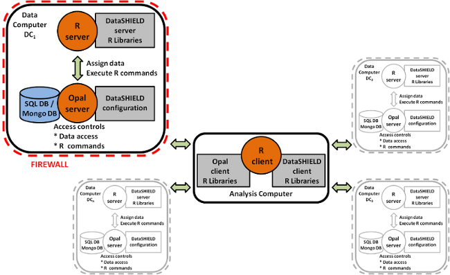
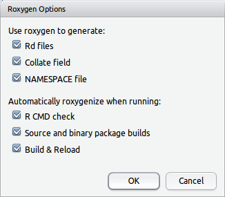



## Overview

* [Set up](#setup)
  * [Server side set up](#serversetup)
  * [Client side set up](#clientsetup)
* [Development Workflow](#flow)
* [Development Guidelines](#dev)
  * [RStudio Project](#project)
  * [DataSHIELD-R Packages](#packages)
  * [Test DataSHIELD-R Packages](#testpackages)
  * [Release DataSHIELD-R Packages](#releasepackages)

## Set up

First you need to setup a development infrastructure for running DataSHIELD analysis. This infrastructure will be based on [Opal](http://wiki.obiba.org/display/OPALDOC).

### Server side set up

At least two Opal server instances, in which different harmonized datasets have been loaded are required to execute some DataSHIELD analysis.

See: [Opal Server Administrator Guide](http://wiki.obiba.org/display/OPALDOC/Opal+Server+Administrator+Guide)

Each Opal server instance must be backed by a R server in which data will be pushed from Opal for being aggregated.

See: [Opal R Server Set Up](http://wiki.obiba.org/display/OPALDOC/Opal+R+and+DataSHIELD+User+Guide#OpalRandDataSHIELDUserGuide-Server-sideInstallation)

An harmonized dataset must be prepared and each Opal server instances will receive data for different set of participants.

See: [Opal Web Application User Guide](http://wiki.obiba.org/display/OPALDOC/Opal+Web+Application+User+Guide)

### Client side set up

R must be installed on the client side.

See: [Download and Install R](http://cran.r-project.org/)

The source code of the R packages for DataSHIELD are hosted on [GitHub](https://github.com/datashield). Git is a VCS (Version Control System), a simple command line tool for keeping a history on the state of your source code projects. Git allows groups of people to work on the same documents (often code) at the same time, and without stepping on each other's toes.

See:
* [Set Up Git](https://help.github.com/articles/set-up-git)
* [Getting Started Installing Git](http://git-scm.com/book/en/Getting-Started-Installing-Git)
* [GitHub Help](https://help.github.com)
* [Try GitHub (tutorial)](http://try.github.com)

We also highly recommend to use an IDE (Integrated Development Environment) software such as [RStudio](http://www.rstudio.com/). RStudio provides a R editor (syntax checking, auto completion...), integrates with Git, allows R packages documentation browsing, uses some nice R build tools and much more.

See: 
* [Download RStudio Desktop](http://www.rstudio.com/ide/download/desktop)
* [Package Development Prerequisites](http://www.rstudio.com/ide/docs/packages/prerequisites)

From a R console you will need to be able to connect to Opal. This requires to install a Opal R Client (*opal* R package).

As a developer you will need to access to some advanced features of Opal, in order to perform batch administration of Opals' DataSHIELD configuration from a R console. This requires to install a Opal Administration R Client (*opaladmin* R package).

	install.packages('opaladmin', repos=c(getOption('repos'), 'http://cran.obiba.org'), dependencies=TRUE)

See: [Opal R Client Set Up](http://wiki.obiba.org/display/OPALDOC/Opal+R+and+DataSHIELD+User+Guide#OpalRandDataSHIELDUserGuide-Client-sideInstallation)

## Development Workflow

Once the [Set Up](#setup) is done, the IT infrastructure is the following:

Where the repositories are:
* [DataSHIELD source repository](https://github.com/datashield)
* [DataSHIELD package repository](http://cran.obiba.org/src/contrib)

The software development flow is:
1. checkout code from source repository: `git clone`, `git pull`, etc.
2. repeat until done:
  * edit code,
  * test.
3. commit code changes: `git commit`, `git push`, etc.
4. tag code, build package and deploy it to the package repository.

At the end of a DataSHIELD development iteration, 2 packages are produced:
* a [DataSHIELD-R package](#packages), holding aggregation and assignment methods, to be deployed on R server,
* a R package, holding the client methods (that makes use of the aggregation and assignment methods deployed on the server side), to be deployed on R client.

In [DataSHIELD source repository](https://github.com/datashield) you will find a repository per R package. Some packages are meant to be deployed on server side and others on client side. An example of DataSHIELD R package for server side is [dsbase](https://github.com/datashield/dsbase). Its client side counter part is [dsbaseclient](https://github.com/datashield/dsbaseclient).

## Development Guidelines

### RStudio Project

Create a RStudio project from the R package source code.

See: 
* [RStudio Package Development Prerequisites](http://www.rstudio.com/ide/docs/packages/prerequisites)
* [Developing Packages with RStudio](http://www.rstudio.com/ide/docs/packages/overview)

Use [Roxygen](http://roxygen.org) annotations to document your R code. The corresponding R package name is *roxygen2*. Roxygen will:
* generate the R manual pages,
* generate entries in the `NAMESPACE` and `DESCRIPTION` files.

To install *roxygen2* in the R console:

	install.packages('roxygen2', repos=c(getOption('repos')), dependencies=TRUE)

See: [RStudio Writing Package Documentation](http://www.rstudio.com/ide/docs/packages/documentation).

We recommend to set the *Build* options of the RStudio project as follow:

* check that the package documentation is to be generated by Roxygen:

* check that Roxygen will also append entries in the `NAMESPACE` and `DESCRIPTION` files:

### DataSHIELD-R Packages

By *DataSHIELD-R package* we define a R package which is meant to be installed in R server for performing DataSHIELD data aggregation and assignment.

DataSHIELD-R packages follow the conventions of R packages. These conventions are extensively described in [Writing R Extensions](http://cran.r-project.org/doc/manuals/R-exts.html) document. The `DESCRIPTION` file in R packages is a set of key-value pairs that describe the package. It is used for describing its name, description, dependencies etc.

DataSHIELD-R packages have some specific `DESCRIPTION` file entries:
* AggregateMethods
* AssignMethods

These entries describe which DataSHIELD aggregation and/or assignment methods are made visible to DataSHIELD clients. The values consist of a list of comma separated method names, optionaly mapped to a package specific method:
* if the method name is provided alone, it will be mapped to its DataSHIELD-R package specific name. For instance when [dsbase](https://github.com/datashield/dsbase) package declares a `summary` method it is mapped to `dsbase::summary`: a DataSHIELD client calling `summary` will execute `dsbase::summary` on server side,
* else if the method name is provided with a map to a specific method (which can be found in any package available in the R server), the corresponding method will be published. For instance declaring `log=base::log` will make DataSHIELD client execute `base::log` on R server when `log` is called.

Example of [dsbase DESCRIPTION file](https://github.com/datashield/dsbase/blob/master/DESCRIPTION):

	...
	AggregateMethods: summary, length=base::length, matrix=base::matrix,
		colnames=base::colnames, mean, var, lm.ds, glm.ds, histogram.1
	AssignMethods: log=base::log, exp=base::exp, sum, product,
		as.list=base::as.list, as.numeric=base::as.numeric,
		as.matrix=base::as.matrix, complete.cases=stats::complete.cases,
		c=base::c, cbind=base::cbind
	...

### Test DataSHIELD-R Packages

Opal DataSHIELD administration offers the possibility to install a DataSHIELD-R package directly from the [DataSHIELD source repository](https://github.com/datashield). This is very convenient when testing the deployment of the package. This can be achieved by providing a Git reference (can be a branch name, a tag name or a commit number).

See: [Opal DataSHIELD Packages Administration](http://wiki.obiba.org/display/OPALDOC/DataSHIELD+Administration#DataSHIELDAdministration-DataSHIELDRepositories)

You can also use R to administrate one or several Opal servers DataSHIELD configurations: *opaladmin* R package provides the Opal administration toolbox.

	install.packages('opaladmin', repos=c(getOption('repos'), 'http://cran.obiba.org'), dependencies=TRUE)

All the functions starting with `dsadmin.` are meant to administer DataSHIELD configuration. The following example installs a DataSHIELD-R package and publish its methods:

	# Login in Opals
	library(opaladmin)
	o1<-opal.login('dsadmin1', 'password', 'http://opal1:8080')
	o2<-opal.login('dsadmin2', 'password', 'http://opal2:8080')
	opals<-list(o1, o2)

	# Install dsbase package on R server from source repository (master branch)
	dsadmin.install_package(opals, 'dsbase', ref='master')

	# Configure datashield methods in opal
	# Clean all previously published package methods
	dsadmin.rm_package_methods(opals, 'dsbase')
	# Publish dsbase package methods
	dsadmin.set_package_methods(opals, 'dsbase')

	# Add some specific methods based on scripts
	dsadmin.set_method(opals, 'some_assign_script', path='/path/to/R/script', type='assign')

### Release DataSHIELD-R Packages

Releasing a package consists of the following steps:
* tag the package source code with a version number in GitHub (the tagged code is read-only and will be used as a reference when building the package),
* increment the version number in the *DESCRIPTION* file (prepare for the next release),
* build a package from its source tag and deploy it in a CRAN (currently done by [OBiBa](http://cran.obiba.org/src/contrib)).

  <strong>Warning!</strong> 
  As a convention, make sure corresponding packages on server and client sides have the same version number. This will facilitate compatibility checks.

The tagging procedure is to be done using the *git* command-line.

First in order to make sure you are working on a clean workspace, clone the repository of the package:

	# Clone package xxx
	git clone https://github.com/datashield/xxx.git
	cd xxx

Then perform the tag operation:

	# Tag the source code locally with the version number defined in the DESCRIPTION file (1.0 for instance)
	git tag -a 1.0 -m "version 1.0"

	# Propagate the new tag to GitHub
	git push --tags

Increment version number in the *DESCRIPTION* file so that development package does not conflict with the released one:

	# Edit DESCRIPTION file with your favorite editor
	vi DESCRIPTION
	
	# Commit changes locally
	git commit -a -m "prepare version 1.1"
	
	# Propagate change to GitHub 
	git push origin master

See: [Learn Tagging on GitHub](http://learn.github.com/p/tagging.html)

If you realize that there is an error in the source code before the release is official, it is still time to fix and re-tag the source code:

	# Remove tag locally
	git tag -d 1.0

	# Propagate tag removal to GitHub
	git push origin :refs/tags/1.0

	# Reverse version in DESCRIPTION file
	vi DESCRIPTION
	
	# Commit changes locally
	git commit -a -m "revert to version 1.0"

	# Edit and fix source code, commit and push changes to GitHub
	...

	# Redo tagging
	...

