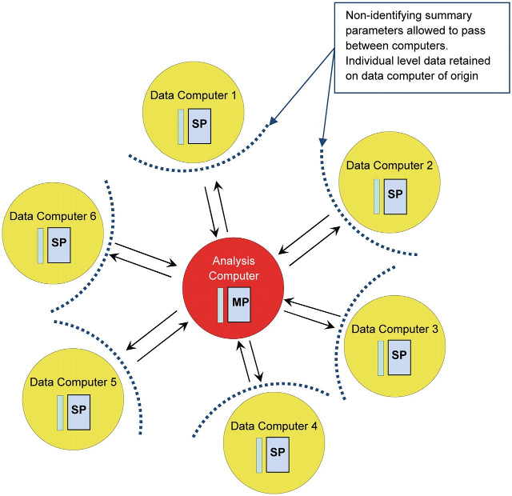



DataSHIELD ([Wolfson et al., 2010](http://ije.oxfordjournals.org/content/39/5/1372.abstract)) is a novel method that enables a pooled data analysis to be carried out across several collaborating studies as if one had full access to all of the data from individual participants that might be needed, but, in reality, these data remain completely secure on their host computer at the home base of the study where they were collected or generated. DataSHIELD therefore permits a fully efficient pooled analysis to be undertaken of biomedical data from several studies, even when ethico-legal or other governance restrictions prohibit the release of individual-level data to third parties.

[Read more about DataSHIELD](about.html)

### DataSHIELD IT Infrastructure

The following figure illustrates the basic IT infrastructure that underpins DataSHIELD; it reflects a hypothetical implementation based on a pooled analysis involving data from six studies. The individual-level data that provide the basis of the analysis remain on *data computers* (DCs) at their home bases. An additional computer is identified as the *analysis computer* (AC). This is the computer on which the primary statistician will type the commands to enact and control the pooled analysis.

A DataSHIELD method open source implementation is available based on [R](http://www.r-project.org/) and [Opal](http://wiki.obiba.org/display/OPALDOC), the [OBiBa](http://obiba.org)'s data warehouse solution for biobanks.

Opal uses the R statistical environment to implement DataSHIELD. The implementation is made of the following components:

* on the Data Computers:
  * an Opal server (with its database(s)),
  * an R server.
* on the Analysis Computer: an R client.

Opal's role is to:
* authenticate and authorize DataSHIELD users,
* push data into R (server side),
* control which methods can be executed in R (server side).

[Read more about DataSHIELD, R and Opal](http://wiki.obiba.org/display/OPALDOC/Opal+R+and+DataSHIELD+User+Guide)

### License

DataSHIELD and OBiBa softwares are open source and made available under the [GPL3 licence](http://www.gnu.org/copyleft/gpl.html#gnu-license). DataSHIELD and OBiBa softwares are free of charge.
